# LearnBaremetalPART5_SPI
building on project 4 learning to write SPI perihperal using LL  ( assuming you know how the SPI COM ) works
Here we will create a new project using your mcu board ( mine is F446RE board ) in cube IDE,
then in settings select LL to access register and not HAL functions

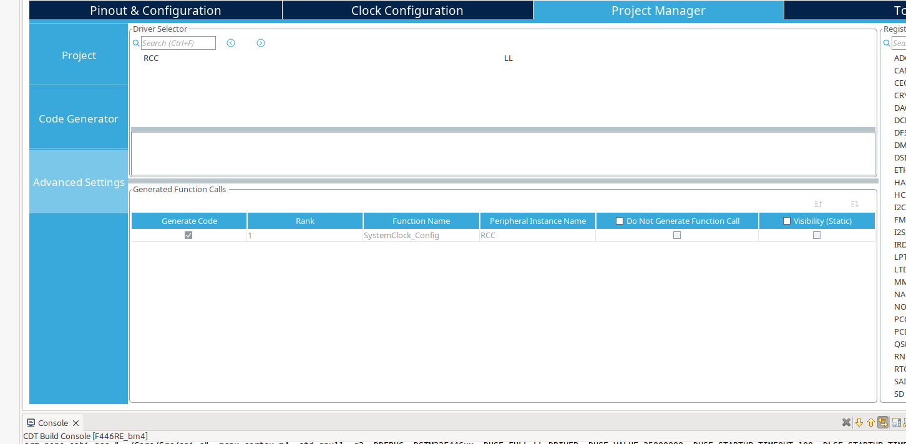

then build the project, once built then add gpio header defining the gpio fucntions
for SPI communcation 

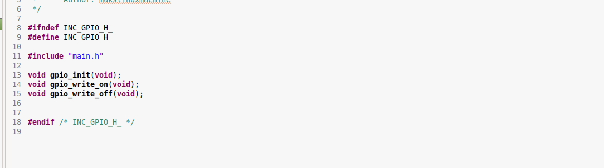

comment out the hal function

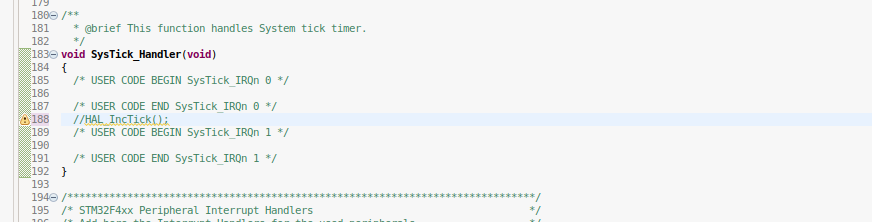

replace with your own delay function in the main.c file

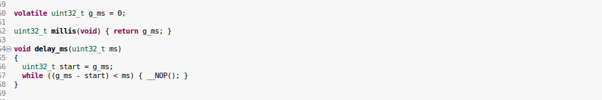

externally define the tick variable and increment in the Systick_Handler in _it.c 

then define the SPI header with spi funcitons ( all registers have been created already using LL ) 

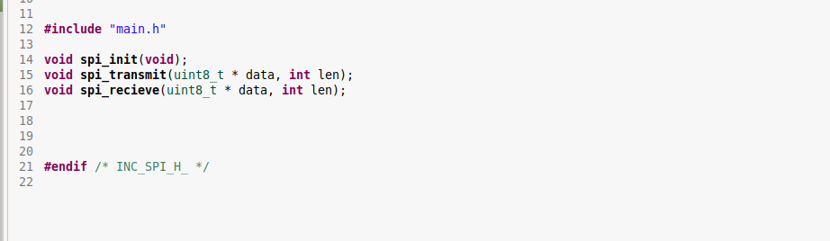

in the GPIO initializtion, we set which pins are alternate functions for SCLK , MISO , MOSI
checking the alternate funcitons mapping for SPI 2 

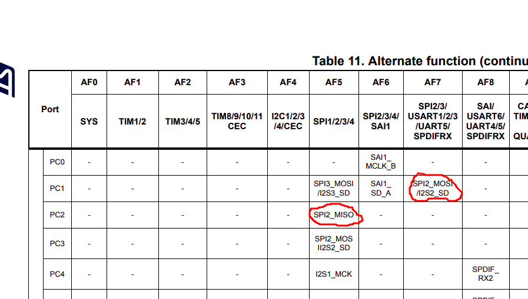
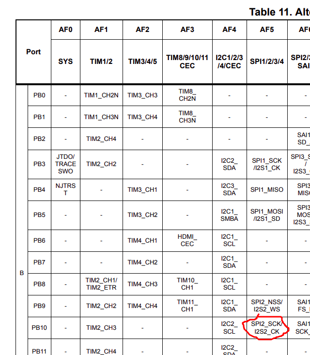

I will be controlling the Chip Select pin seperately using GPIO output A9,
the steps are same form the perivous parts for GPIO 

: 1. enable clock access

: 2. set GPIO mode to appropriate functions

: 3. set GPIO AFR register pin to appropriate AF functions

: 4. set GPIO output data register to Chip select (CS)  pin

: 5. write functions to turn on Chip selects

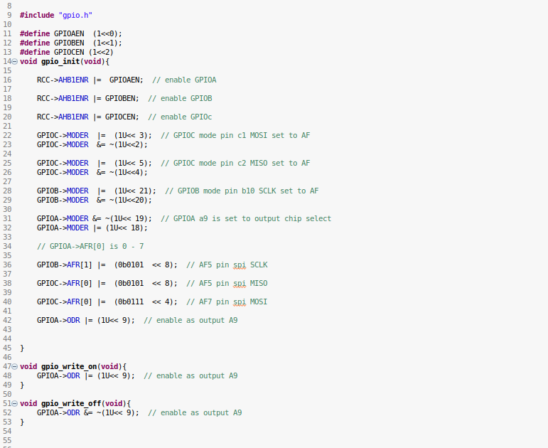

now for the spi initilizaiton

1. enable clock access from RCC bus on the block diagram

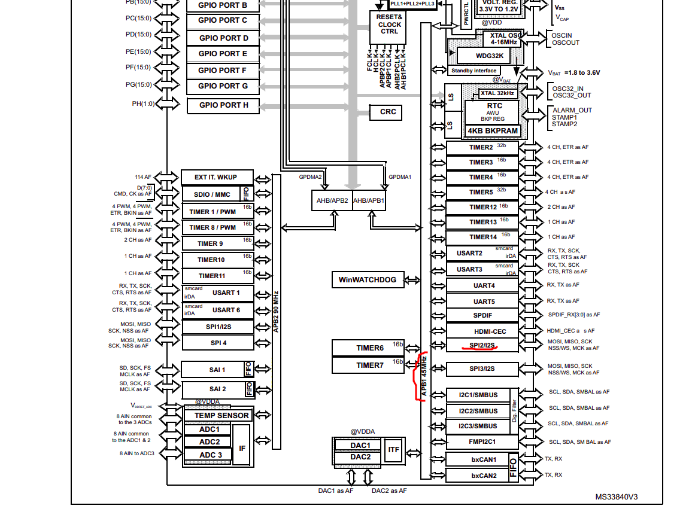

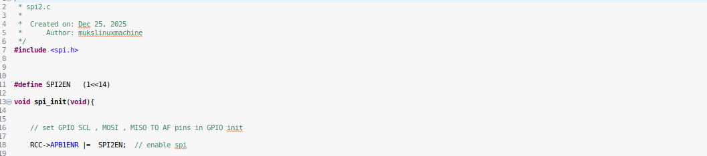

using the Control 1 register 

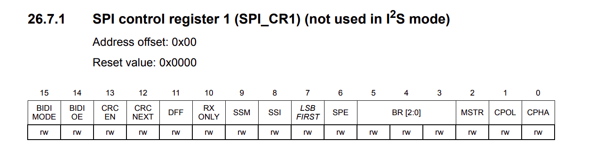

( All depending on chip you want to communicate to )
set prescalar SPI speed 

Clock polarity ( 1 = idle high)

Clock phase ( c1 = capture data at second egde ) 

and set SPI to master mode 

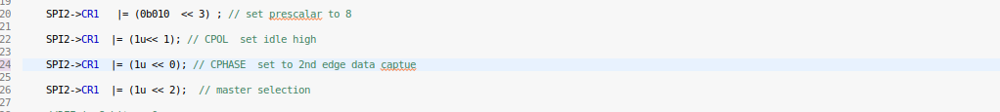

enable software slave management telling the SPI peripheral you will control CS on your own, 
and force internal CHip select ( what datasheet calls NSS) high

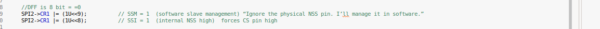

lastly, enable SPI 

General rule : every spi transactions is a transmit +  recieve, they are not seperate 

for transmitting you dont care about what you recieve 

for reciecing you DO  care about what you recieve 

create a state in line function that completes a Spi transcation/transfer then use in a  transmit or recieve fucntion

1. check the status register to make sure TX is not busy

2. then you transmit data
   
3. chekc the status register to make sure RX is not empty

4. then you recieve

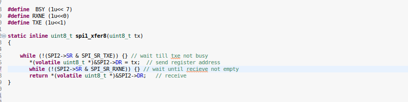

then the transmit and recieve funcitons become trivial 

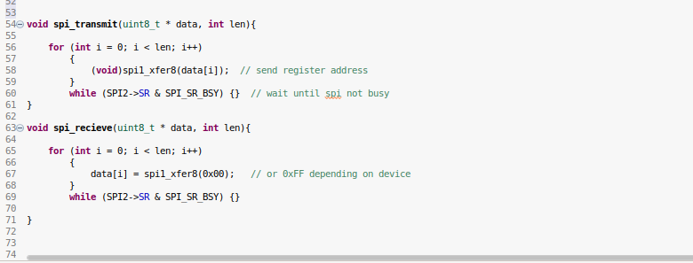

then to test the SPI peripheral, you write or read a chip, mine will be the adxl345 accelerometer
according to its data sheet, reading DEVID register 0x00 should produce a response of 0xe5 

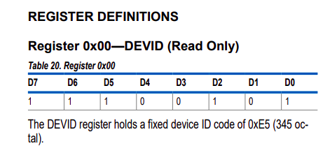
in the main function, include the headers then write this function to read the adxl345

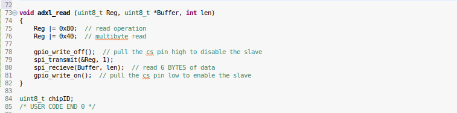

main function

test it here

https://www.youtube.com/shorts/espm8UOb6G8

